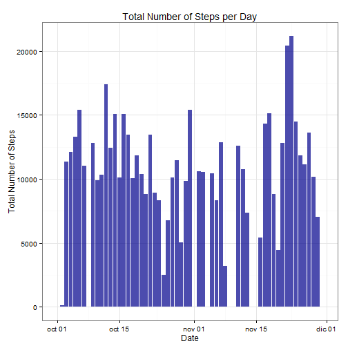
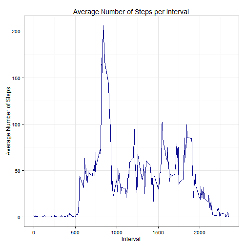
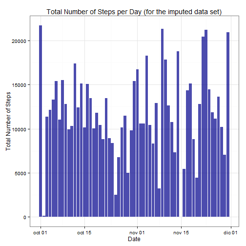
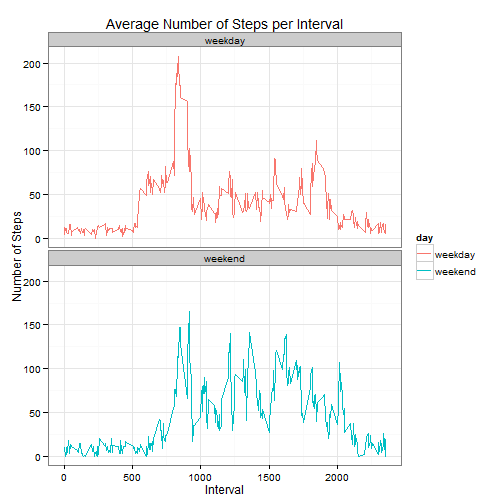

# Reproducible Research: Peer Assessment 1

## Introduction

This assignment makes use of data from a personal activity monitoring
device. This device collects data at 5 minute intervals through out the
day. The data consists of two months of data from an anonymous
individual collected during the months of October and November, 2012
and include the number of steps taken in 5 minute intervals each day.

## Data

The data for this assignment can be downloaded from the course web
site:

* Dataset: [Activity monitoring data](https://d396qusza40orc.cloudfront.net/repdata%2Fdata%2Factivity.zip) [52K]

The variables included in this dataset are:

* **steps**: Number of steps taking in a 5-minute interval (missing
    values are coded as `NA`)

* **date**: The date on which the measurement was taken in YYYY-MM-DD
    format

* **interval**: Identifier for the 5-minute interval in which
    measurement was taken

## Loading and preprocessing the data

Load (and install if not present) required packages.


```r
if (!require(data.table)) {
    install.packages("data.table")
    require(data.table)
}
if (!require(ggplot2)) {
    install.packages("ggplot2")
    require(ggplot2)
}
if (!require(Amelia)) {
    install.packages("Amelia")
    require(Amelia)
}
```


Download, unzip and read the data file. Convert **date** variable into a class `Date` object.


```r
url <- "http://d396qusza40orc.cloudfront.net/repdata%2Fdata%2Factivity.zip"  # https not supported yet
dataFile <- basename(url)
download.file(url, dataFile)
unzip(dataFile)

activityData <- fread("activity.csv", sep = ",")
activityData <- activityData[, `:=`(date, as.Date(date))]
setkey(activityData, date, interval)
```


## What is mean total number of steps taken per day?

1. Plot a histogram of the total number of steps taken each day (ignoring missing values).


```r
totalSteps <- activityData[, sum(steps, na.rm = TRUE), by = date]  # Get the total daily steps
setnames(totalSteps, c("date", "total.steps"))

steps.hist <- ggplot(totalSteps, aes(x = date, y = total.steps)) + theme_bw()
steps.hist <- steps.hist + geom_histogram(stat = "identity", fill = "dark blue", 
    alpha = 0.7)
steps.hist <- steps.hist + labs(title = "Total Number of Steps per Day", x = "Date", 
    y = "Total Number of Steps")
print(steps.hist)
```

 


2. Calculate and report the mean and median total number of steps taken per day

**Mean** = 9354.22950819672 
**Median** = 10395 


## What is the average daily activity pattern?

1. Make a time series plot (i.e. `type = "l"`) of the 5-minute interval (x-axis) and the average number of steps taken, averaged across all days (y-axis)


```r
meanStepsInterval <- activityData[, mean(steps, na.rm = TRUE), by = interval]  # Get the mean steps per interval
setnames(meanStepsInterval, c("interval", "mean.steps"))

time.series <- ggplot(meanStepsInterval, aes(x = interval, y = mean.steps)) + 
    theme_bw()
time.series <- time.series + geom_line(color = "dark blue") + labs(title = "Average Number of Steps per Interval", 
    x = "Interval", y = "Average Number of Steps")
print(time.series)
```

 


2. Which 5-minute interval, on average across all the days in the dataset, contains the maximum number of steps?

The maximum number of steps is in interval: **835**


## Imputing missing values

1. Calculate and report the total number of missing values in the dataset (i.e. the total number of rows with `NA`s)

The total number of rows with NA values is: **2304**


2. Devise a strategy for filling in all of the missing values in the dataset. The strategy does not need to be sophisticated. For example, you could use the mean/median for that day, or the mean for that 5-minute interval, etc.
3. Create a new dataset that is equal to the original dataset but with the missing data filled in.


```r
# To impute missing values, the Amelia package will be used. It performs
# multiple imputation, a general-purpose approach to data with missing
# values. Multiple imputation has been shown to reduce bias and increase
# efficiency compared to listwise deletion.
set.seed(5)  # Set seed for reproducibility of results
imputed <- amelia(activityData, m = 5, ts = "date", ords = "steps", p2s = 0)
imputed <- imputed$imputations[[1]]  # Choosing the first imputation
```


4. Make a histogram of the total number of steps taken each day.


```r
imputedTotalSteps <- imputed[, sum(steps), by = date]
setnames(imputedTotalSteps, c("date", "total.steps"))
imputed.hist <- ggplot(imputedTotalSteps, aes(x = date, y = total.steps)) + 
    theme_bw()
imputed.hist <- imputed.hist + geom_histogram(stat = "identity", fill = "dark blue", 
    alpha = 0.7)
imputed.hist <- imputed.hist + labs(title = "Total Number of Steps per Day (for the imputed data set)", 
    x = "Date", y = "Total Number of Steps")
print(imputed.hist)
```

 


Calculate and report the **mean** and **median** total number of steps taken per day.
Do these values differ from the estimates from the first part of the assignment?
What is the impact of imputing missing data on the estimates of the total daily number of steps?

**Mean** = 11831.1803278689 
**Median** = 11458 


The mean increases when we replace the `NA` values with the imputed data.
The median, being more robust, stays approximately equal.

## Are there differences in activity patterns between weekdays and weekends?

1. Create a new factor variable in the dataset with two levels -- "weekday" and "weekend" indicating whether a given date is a weekday or weekend day.


```r
Sys.setlocale("LC_TIME", "English_United States.1252")
```

```
## [1] "English_United States.1252"
```

```r
imputed[, `:=`(day, weekdays(date))]
```

```
##        steps       date interval    day
##     1:    44 2012-10-01        0 Monday
##     2:    22 2012-10-01        5 Monday
##     3:   223 2012-10-01       10 Monday
##     4:   204 2012-10-01       15 Monday
##     5:     0 2012-10-01       20 Monday
##    ---                                 
## 17564:     0 2012-11-30     2335 Friday
## 17565:   119 2012-11-30     2340 Friday
## 17566:   103 2012-11-30     2345 Friday
## 17567:    46 2012-11-30     2350 Friday
## 17568:   135 2012-11-30     2355 Friday
```

```r
weekendDays <- c("Sunday", "Saturday")
imputed[, `:=`(day, ifelse(day %in% weekendDays, "weekend", "weekday"))]
```

```
##        steps       date interval     day
##     1:    44 2012-10-01        0 weekday
##     2:    22 2012-10-01        5 weekday
##     3:   223 2012-10-01       10 weekday
##     4:   204 2012-10-01       15 weekday
##     5:     0 2012-10-01       20 weekday
##    ---                                  
## 17564:     0 2012-11-30     2335 weekday
## 17565:   119 2012-11-30     2340 weekday
## 17566:   103 2012-11-30     2345 weekday
## 17567:    46 2012-11-30     2350 weekday
## 17568:   135 2012-11-30     2355 weekday
```

```r
imputed$day <- as.factor(imputed$day)
```


2. Make a panel plot containing a time series plot (i.e. `type = "l"`) of the 5-minute interval (x-axis) and the average number of steps taken, averaged across all weekday days or weekend days (y-axis).


```r
imputedMeanSteps <- imputed[, mean(steps), by = "interval,day"]
setnames(imputedMeanSteps, c("interval", "day", "mean.steps"))

ts.weekdays <- ggplot(imputedMeanSteps, aes(x = interval, y = mean.steps, color = day)) + 
    geom_line()
ts.weekdays <- ts.weekdays + facet_wrap(~day, nrow = 2) + theme_bw()
ts.weekdays <- ts.weekdays + labs(title = "Average Number of Steps per Interval", 
    x = "Interval", y = "Number of Steps")
print(ts.weekdays)
```

 

